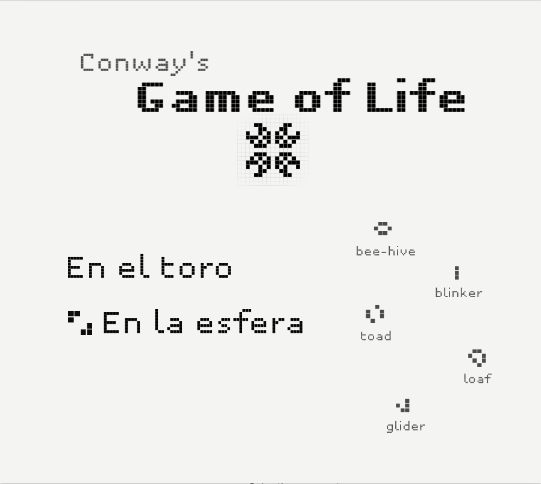
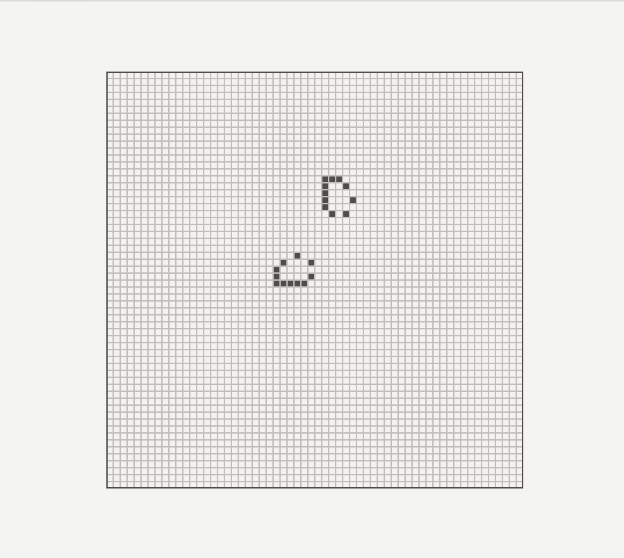
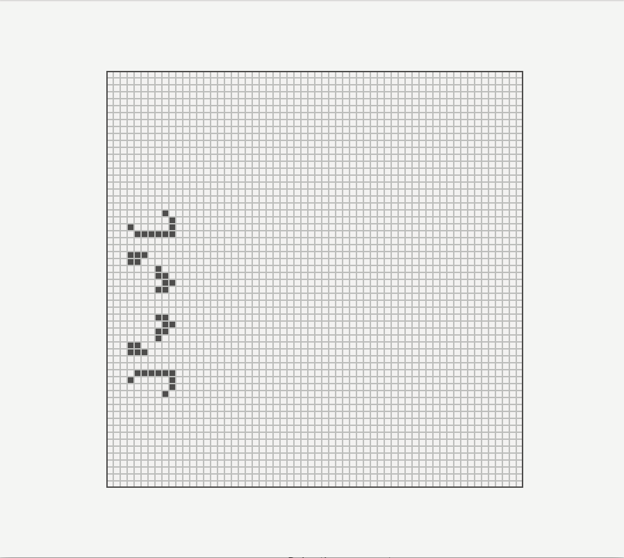

# OrientableGameOfLife
Game of life on a sphere and a torus

## Examples

#### Menu

#### Spaceships on a torus

#### Puffer on a sphere

## Usage

- `Enter` and `←↑↓→` to select an option inside the menu

- Use the mouse to paint a pattern in the grid

- `Ctrl+s` to save a pattern

- `Ctrl+o` to load a pattern

- `Space` to start or stop the execution
